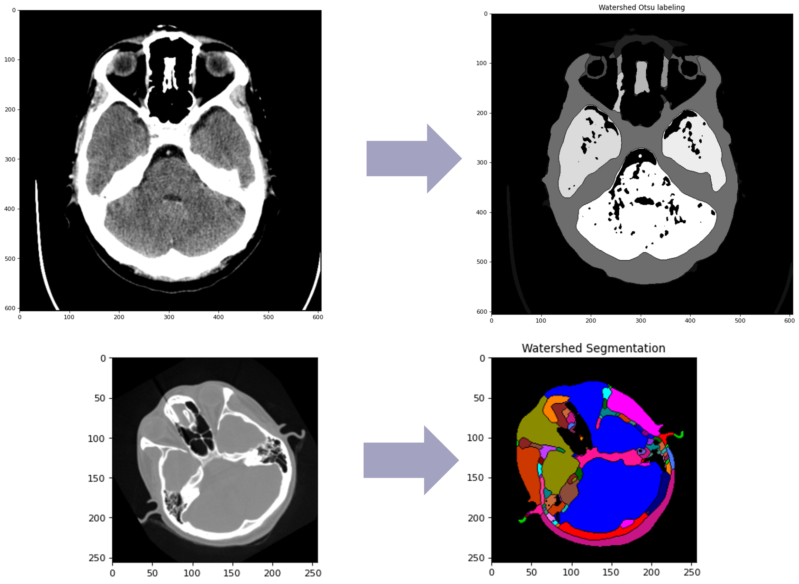

# Visión Computacional - Implementación de Algoritmo de Watershed

* Armando Bringas Corpus - A01200230
* Guillermo Alfonso Muñiz Hermosillo - A01793101
* Jorge Luis Arroyo Chavelas - A01793023
* Samantha R Mancias Carrillo - A01196762
* Sofia E Mancias Carrillo - A01196563

---

Exploración e implementación con las librerías de OpenCV, skimage y SimpleITK del algoritmo de Watershed.

Se muestran dos ejemplos aplicados a segmentación de regiones del cerebro humano en MRI y análisis de núcleso de células en osteosarcoma 

> **_NOTA:_** Para poder ejecutar el código se sugiere crear un ambiente virtual con Anaconda o PIP e instalar las líbrerias correspondientes

---

## Contenidos

* [Jupyter Notebook (.ipnyb)](segmentation_watershed.ipynb)
* [Jupyter Notebook (.PDF)](segmentation_watershed.pdf)
* [Presentación del Proyecto Final](ImageSegmentation_Watershed.pdf)

